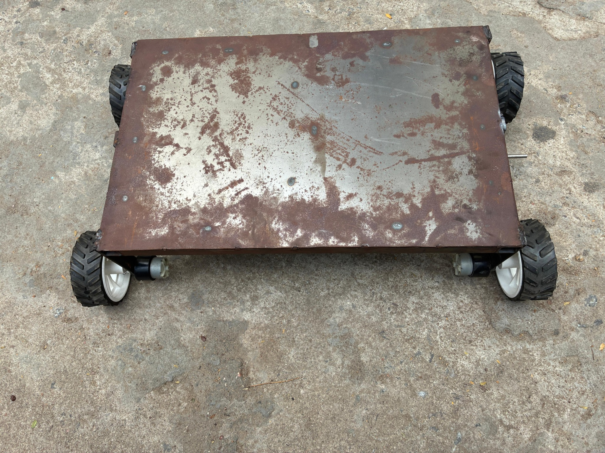
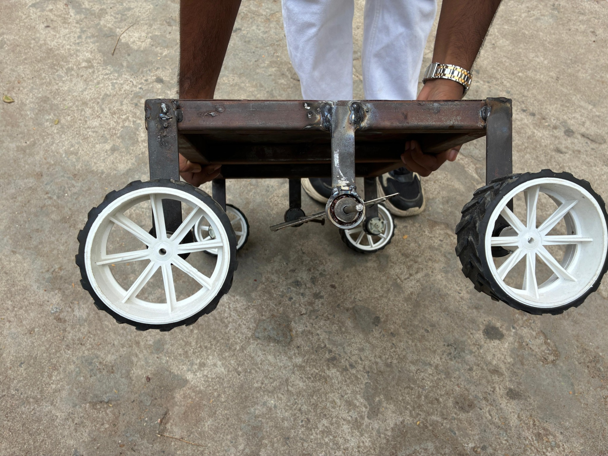
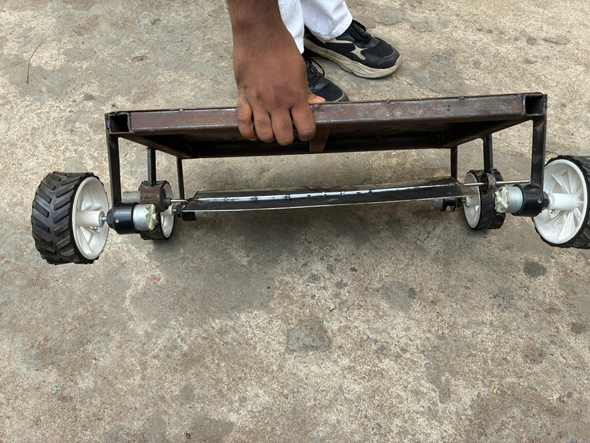
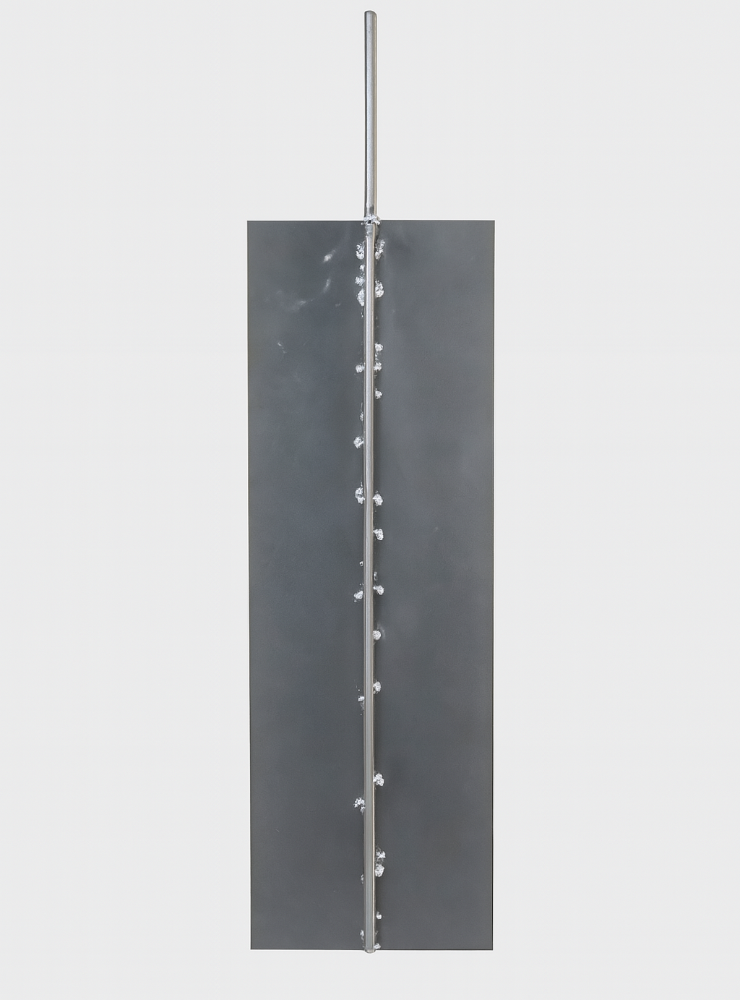
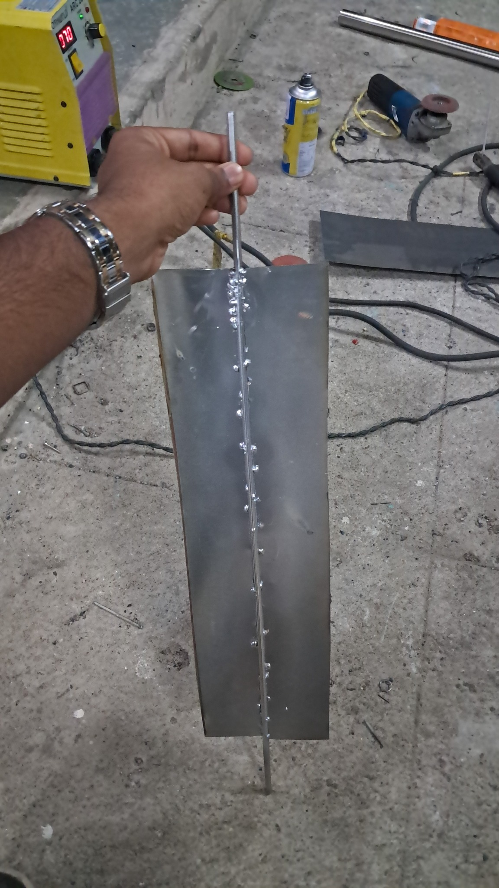

# Automated Paddy Shuffler Vehicle (APSV)

A smart agricultural robot designed to automate and optimize the paddy drying process. Developed as part of a real-time research project under the Department of Electrical and Electronics Engineering, JNTUH-UCESTH.

---

## 🚜 Project Overview
Manual sun drying of paddy is labor-intensive, inconsistent, and susceptible to crop spoilage. The **Automated Paddy Shuffler Vehicle (APSV)** addresses these issues by automating the redistribution of paddy during drying.

> APSV aims to reduce drying time, improve grain quality, and reduce dependency on manual labor.

---

## 🔍 Problem Statement
- 80% of India's paddy is dried using open sun drying methods
- This leads to:
  - Uneven drying and grain spoilage
  - 5–7% weight loss
  - 10–20% drop in market value
  - Heavy labor requirement (4–6 people per acre)

---

## 💡 Proposed Solution
- A semi-autonomous vehicle that shuffles paddy uniformly across the yard
- Controlled via a mobile app using Wi-Fi
- Includes obstacle detection, blade motor, and speed control

---

## 🛠️ Components Used
- **Microcontroller:** ESP32
- **Motors:** 4 Gear motors for movement, 1 Johnson motor for shuffling
- **Motor Control:** L298N Dual H-Bridge + 4-Channel Relay Module
- **Sensors:** HC-SR04 Ultrasonic for obstacle detection
- **Display:** I2C LCD (16x2)
- **Power:** 12V 14AH battery

---

## 🔄 System Workflow

Currently, the APSV is operational for forward and backward movement with the shuffler blade running in sync. Steering and obstacle detection modules are planned for future development.

```mermaid
graph TD
A[Mobile App Input] --> B[ESP32 Controller]
B --> C[Motor Driver (L298N)]
C --> D[Wheel Motors]
B --> E[Relay Module]
E --> F[Blade Motor (Johnson)]
B --> G[Ultrasonic Sensor]
G --> B
B --> H[LCD Display]
```

---

## ⚙️ Chassis & Mechanical
- Metal chassis with 110mm tires
- Welded shuffler: 6mm pipe, 455mm x 60mm blades
- One end welded to Johnson motor; other mounted via ball bearing
- Ground clearance: < 10mm

---

## 📊 Results & Outcomes
| Metric               | Traditional Drying | APSV Drying        |
|----------------------|--------------------|--------------------|
| Drying Time          | 3–4 days           | 2–2.5 days         |
| Manual Labor         | 4–6 workers        | 0 (App-controlled) |
| Moisture Uniformity  | Low                | High (12–14%)      |
| Spoilage Risk        | High               | Low                |
| Market Value Impact  | ↓ 10–20%           | ↑ 10–20%           |

---

## 📌 Future Scope
- Steering integration for directional control
- Obstacle detection using ultrasonic sensors
- Distance measurement and path planning
- ESP32-CAM for navigation
- Solar-powered recharging for longer autonomy
- AI-based path memorization and decision-making
- Steerable chassis for navigation
- Environmental sensors (moisture/temp)
- Solar-powered operation
- AI-based obstacle avoidance and path learning

---

## 👨‍💻 Authors
- Abhilash Cherry Gosala
- Saggurthi Praveena
- Aditya Narayan Sutar

Under the guidance of **Sri G. Chandra Shekar**, Assistant Professor, JNTUH-UCESTH

---

## 📆 Development Progress

### ✅ Current Capabilities
- Forward and backward mobility
- Shuffler blade rotation
- Manual app-based control

### 🔄 In Progress / Upcoming
- Steering system for directional control
- Ultrasonic sensor integration for obstacle detection
- Automation of obstacle handling logic

---

## 🖼️ Project Visuals

### Chassis Design
- **Top View**  
  

- **Side View**  
  

- **Front View**  
  

### Shuffler Blade
- **Rendered (Clean View)**  
  

- **Actual Fabrication**  
  

---

## 🎥 Shuffler Demo
<a href="videos/shuffler_demo.mp4">▶️ Watch the demonstration video</a>

---

## 📎 Note
The source code is part of internal academic evaluation and has not been published here. A demonstration video and modular prototype will be included in future updates.

> For more details or collaboration inquiries, feel free to reach out via LinkedIn.
