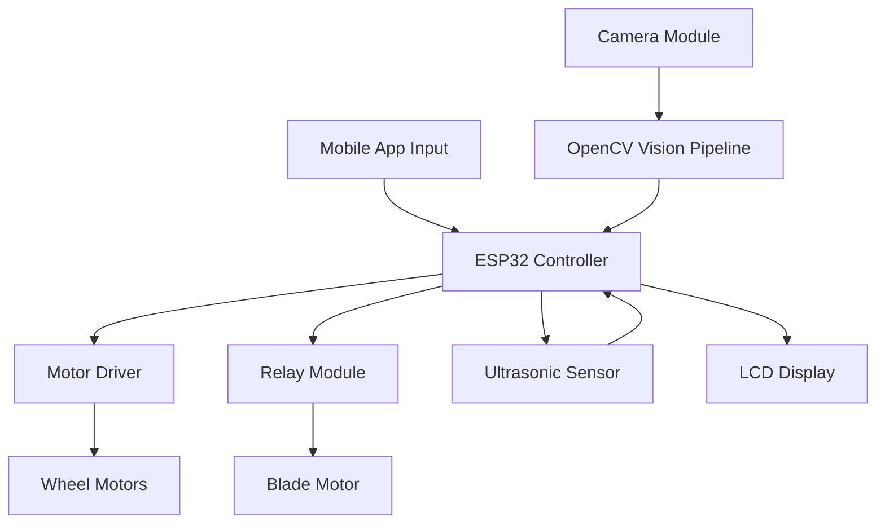
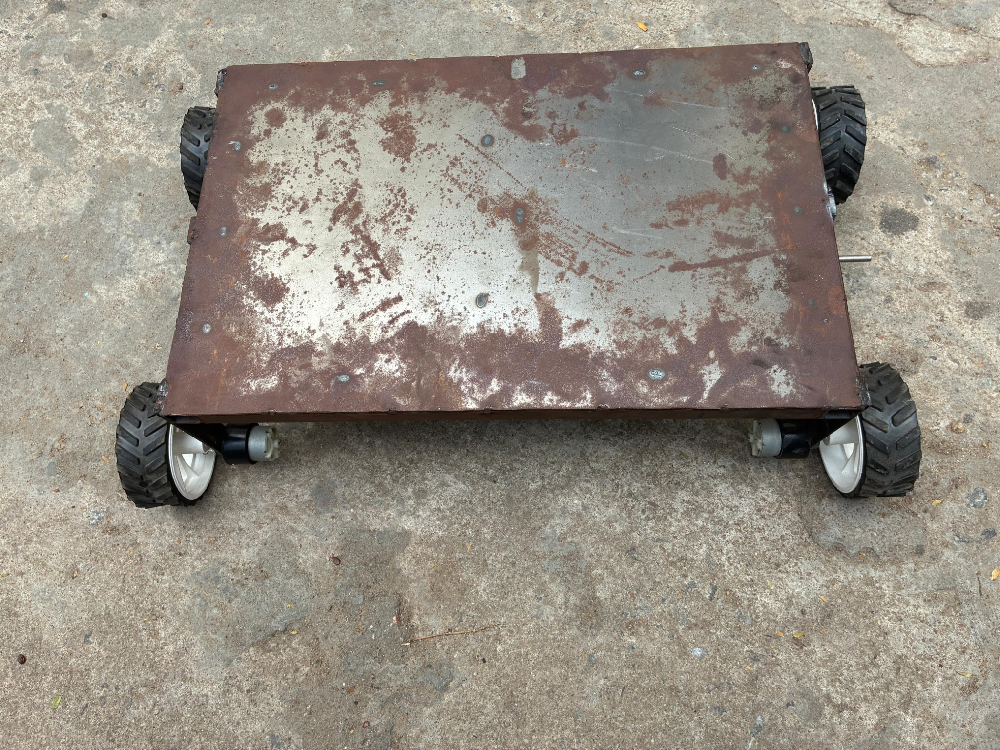
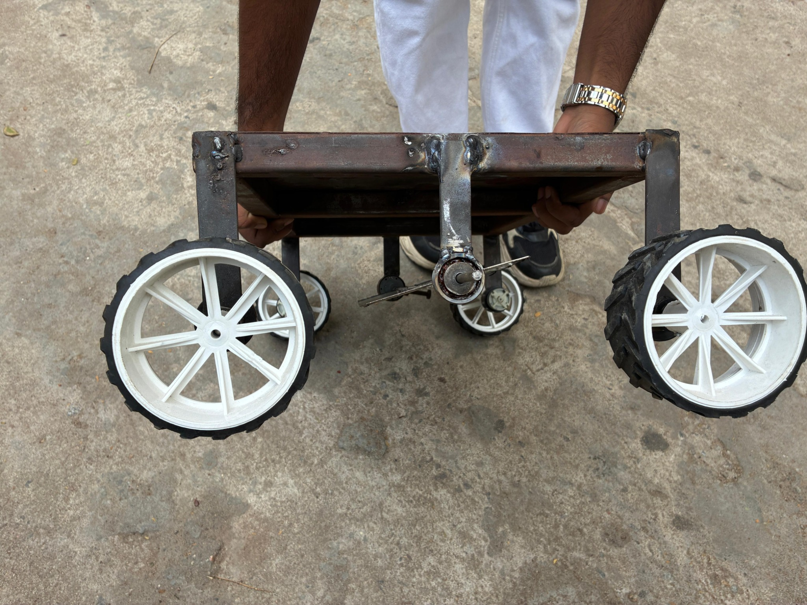
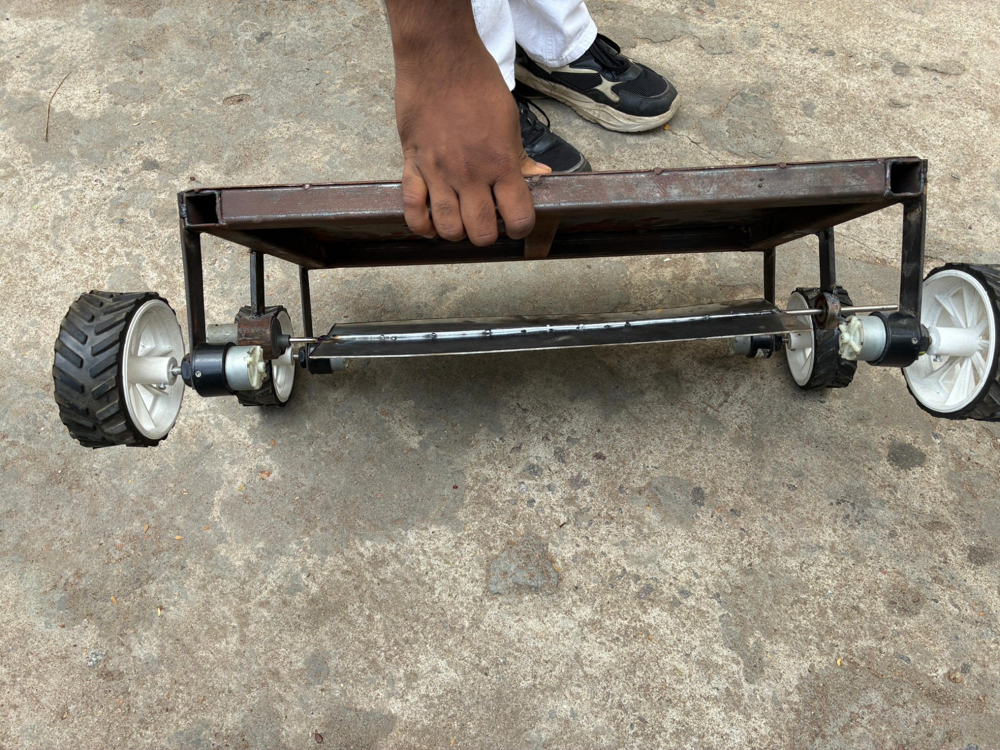
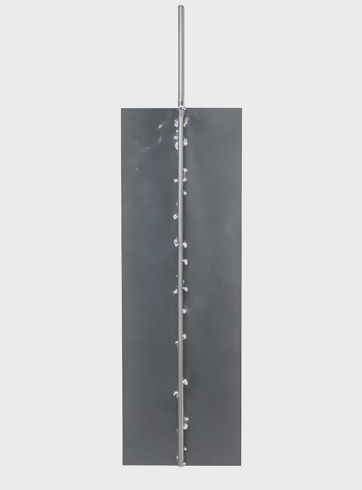
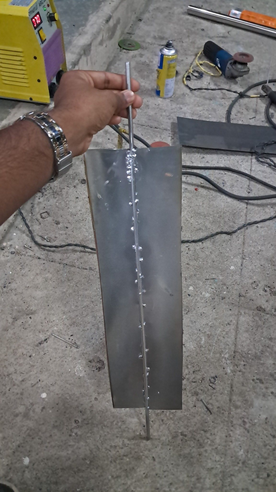

# Automated Paddy Shuffler Vehicle (APSV)

A smart agricultural robot designed to automate and optimize the paddy drying process. Developed as part of a real-time research project under the Department of Electrical and Electronics Engineering, JNTUH-UCESTH.

---

## Project Overview
Manual sun drying of paddy is labor-intensive, inconsistent, and susceptible to crop spoilage. The **Automated Paddy Shuffler Vehicle (APSV)** addresses these issues by automating the redistribution of paddy during drying.

> APSV is a Cyber-Physical System combining embedded control (Arduino), computer vision (OpenCV), and intelligent decision logic to reduce drying time, improve grain quality, and reduce dependency on manual labor.

---

## Problem Statement
- 80% of India's paddy is dried using open sun drying methods
- This leads to:
  - Uneven drying and grain spoilage
  - 5–7% weight loss
  - 10–20% drop in market value
  - Heavy labor requirement (4–6 people per acre)

---

## Proposed Solution
- A semi-autonomous vehicle that shuffles paddy uniformly across the yard
- Controlled via a mobile app using Wi-Fi
- Includes obstacle detection, blade motor, and speed control
- Computer vision pipeline for intelligent navigation and decision-making

---

## Project Structure
- **embedded/** : Microcontroller (Arduino/ESP32) code
- **vision/** : OpenCV camera and image processing pipeline
- **cps/** : Cyber-Physical System decision-making logic
- **images/** : Chassis and hardware photographs
- **videos/** : Demonstration videos
- **docs/** : Technical documentation

---

## Components Used
- **Microcontroller:** ESP32
- **Motors:** 4 Gear motors for movement, 1 Johnson motor for shuffling
- **Motor Control:** L298N Dual H-Bridge + 4-Channel Relay Module
- **Sensors:** HC-SR04 Ultrasonic for obstacle detection
- **Display:** I2C LCD (16x2)
- **Power:** 12V 14AH battery
- **Vision:** Camera module for OpenCV-based navigation

---

## System Workflow

Currently, the APSV is operational for forward and backward movement with the shuffler blade running in sync. Steering, obstacle detection, and vision pipeline integration are in active development.

```mermaid
graph TD
A[Mobile App Input] --> B[ESP32 Controller]
B --> C[Motor Driver]
C --> D[Wheel Motors]
B --> E[Relay Module]
E --> F[Blade Motor]
B --> G[Ultrasonic Sensor]
G --> B
B --> H[LCD Display]
I[Camera Module] --> J[OpenCV Vision Pipeline]
J --> B
```

---

## Vision Pipeline (CPS Development)

The computer vision system is being developed in stages:

### Stage 1: Camera Testing
- Basic camera initialization and frame capture
- Real-time video stream processing
- See: `vision/camera_test.py`

### Stage 2: Grayscale Conversion
- Convert color frames to grayscale for efficient processing
- Foundation for edge detection and thresholding
- See: `vision/grayscale.py`

### Stage 3: Binary Thresholding
- Live binary image conversion for obstacle detection
- Trackbar-based threshold adjustment
- Real-time visualization of processed frames
- See: `vision/thresholding.py`

For complete CPS vision pipeline documentation, refer to: [APSV_CPS_VISION_PIPELINE_DOCUMENTATION.txt](APSV_CPS_VISION_PIPELINE_DOCUMENTATION.txt)

---

## Chassis & Mechanical
- Metal chassis with 110mm tires
- Welded shuffler: 6mm pipe, 455mm x 60mm blades
- One end welded to Johnson motor; other mounted via ball bearing
- Ground clearance: < 10mm

---

## Results & Outcomes
| Metric               | Traditional Drying | APSV Drying        |
|----------------------|--------------------|--------------------|
| Drying Time          | 3–4 days           | 2–2.5 days         |
| Manual Labor         | 4–6 workers        | 0 (App-controlled) |
| Moisture Uniformity  | Low                | High (12–14%)      |
| Spoilage Risk        | High               | Low                |
| Market Value Impact  | ↓ 10–20%           | ↑ 10–20%           |

---

## Future Scope
- Steering integration for directional control
- Obstacle detection using ultrasonic sensors
- Distance measurement and path planning
- ESP32-CAM for navigation
- Solar-powered recharging for longer autonomy
- AI-based path memorization and decision-making
- Steerable chassis for navigation
- Environmental sensors (moisture/temp)
- Solar-powered operation
- AI-based obstacle avoidance and path learning
- Complete CPS integration with vision-based decision making

---

## Authors
- Abhilash Cherry Gosala
- Saggurthi Praveena
- Aditya Narayan Sutar

Under the guidance of **Sri G. Chandra Shekar**, Assistant Professor, JNTUH-UCESTH

---

## Development Progress

### Current Capabilities
- Forward and backward mobility
- Shuffler blade rotation
- Manual app-based control
- Basic vision pipeline (camera, grayscale, thresholding)

### In Progress / Upcoming
- Steering system for directional control
- Ultrasonic sensor integration for obstacle detection
- Automation of obstacle handling logic
- Vision-based navigation and decision making
- CPS integration for autonomous operation

---

## Project Visuals

### Chassis Design
- **Top View**  
  

- **Side View**  
  

- **Front View**  
  

### Shuffler Blade
- **Rendered (Clean View)**  
  

- **Actual Fabrication**  
  

---

## Shuffler Demo
<a href="videos/shuffler_demo.mp4">▶️ Watch the demonstration video</a>

---

## Note
The source code is part of internal academic evaluation and is being incrementally published as development progresses. This repository includes the embedded control system, computer vision pipeline, and CPS decision logic.

> For more details or collaboration inquiries, feel free to reach out via LinkedIn.
